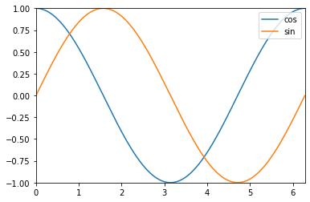
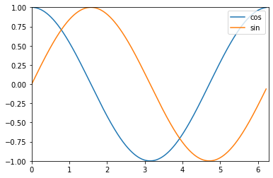

# Basic use

``` python
from fastprogress.fastprogress import master_bar, progress_bar
import time
```

<!-- WARNING: THIS FILE WAS AUTOGENERATED! DO NOT EDIT! -->

``` python
mb = master_bar(range(10))
for i in mb:
    for j in progress_bar(range(100), parent=mb):
        time.sleep(0.01)
        mb.child.comment = f'second bar stat'
    mb.main_bar.comment = f'first bar stat'
    mb.write(f'Finished loop {i}.')
```

Finished loop 0.<p>Finished loop 1.<p>Finished loop 2.<p>Finished loop 3.<p>Finished loop 4.<p>Finished loop 5.<p>Finished loop 6.<p>Finished loop 7.<p>Finished loop 8.<p>Finished loop 9.

## Adding the graph

``` python
import numpy as np
```

``` python
mb = master_bar(range(10))
#Name of the curves to put in the legend box.
mb.names = ['cos', 'sin']
for i in mb:
    for j in progress_bar(range(100), parent=mb):
        time.sleep(0.01)
        mb.child.comment = f'second bar stat'
    mb.main_bar.comment = f'first bar stat'
    mb.write(f'Finished loop {i}.')
    x = np.arange(0, 2*(i+1)*np.pi/10, 0.01)
    y1, y2 = np.cos(x), np.sin(x)
    graphs = [[x,y1], [x,y2]]
    #Specifying the boundaries is better to have the box at the right size.
    x_bounds = [0, 2*np.pi]
    y_bounds = [-1,1]
    mb.update_graph(graphs, x_bounds, y_bounds)
```

Finished loop 0.<p>Finished loop 1.<p>Finished loop 2.<p>Finished loop 3.<p>Finished loop 4.<p>Finished loop 5.<p>Finished loop 6.<p>Finished loop 7.<p>Finished loop 8.<p>Finished loop 9.



Updating every iteration in the inner loop is possible but slower

``` python
mb = master_bar(range(10))
mb.names = ['cos', 'sin']
for i in mb:
    for j in progress_bar(range(100), parent=mb):
        if j%10 == 0:
            k = 100 * i + j
            x = np.arange(0, 2*k*np.pi/1000, 0.01)
            y1, y2 = np.cos(x), np.sin(x)
            graphs = [[x,y1], [x,y2]]
            x_bounds = [0, 2*np.pi]
            y_bounds = [-1,1]
            mb.update_graph(graphs, x_bounds, y_bounds)
            mb.child.comment = f'second bar stat'
    mb.main_bar.comment = f'first bar stat'
    mb.write(f'Finished loop {i}.')
```

Finished loop 0.<p>Finished loop 1.<p>Finished loop 2.<p>Finished loop 3.<p>Finished loop 4.<p>Finished loop 5.<p>Finished loop 6.<p>Finished loop 7.<p>Finished loop 8.<p>Finished loop 9.



## Console rendering

``` python
from fastprogress.fastprogress import ConsoleMasterBar, ConsoleProgressBar
```

``` python
mb = ConsoleMasterBar(range(10))
for i in mb:
    for j in ConsoleProgressBar(range(100), parent=mb):
        time.sleep(0.01)
        mb.child.comment = f'second bar stat'
    mb.write(f'Finished loop {i}.')
```

    Finished loop 0.                                                                                                
    Finished loop 1.                                                                                                
    Finished loop 2.                                                                                                
    Finished loop 3.                                                                                                
    Finished loop 4.                                                                                                
    Finished loop 5.                                                                                                
    Finished loop 6.                                                                                                
    Finished loop 7.                                                                                                
    Finished loop 8.                                                                                                
    Finished loop 9.                                                                                                

You can force the console rendering without changing your code by using
the following command:

``` python
from fastprogress import force_console_behavior
master_bar,progress_bar = force_console_behavior()
```

``` python
mb = master_bar(range(10))
for i in mb:
    for j in progress_bar(range(100), parent=mb):
        time.sleep(0.01)
        mb.child.comment = f'second bar stat'
    mb.main_bar.comment = f'first bar stat'
    mb.write(f'Finished loop {i}.')
    #mb.update_graph(graphs, x_bounds, y_bounds)
```

    Finished loop 0.                                                                                                
    Finished loop 1.                                                                                                
    Finished loop 2.                                                                                                
    Finished loop 3.                                                                                                
    Finished loop 4.                                                                                                
    Finished loop 5.                                                                                                
    Finished loop 6.                                                                                                
    Finished loop 7.                                                                                                
    Finished loop 8.                                                                                                
    Finished loop 9.                                                                                                
